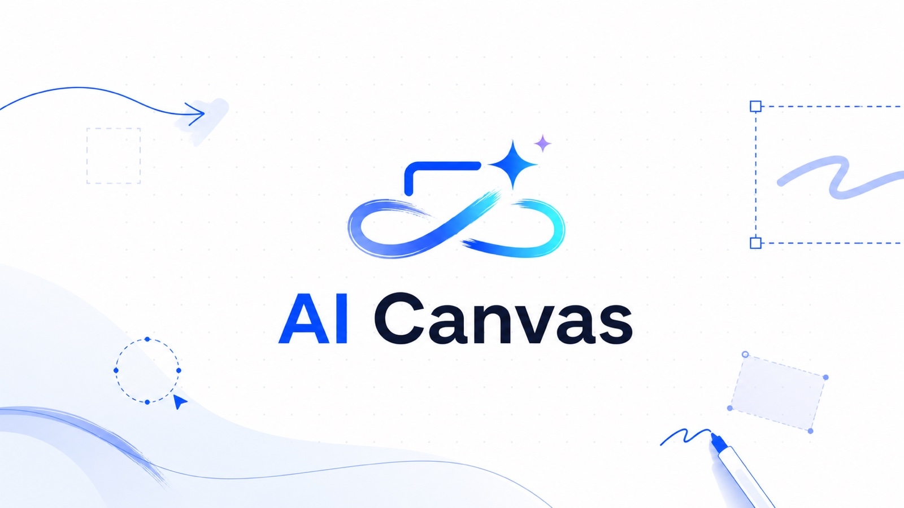
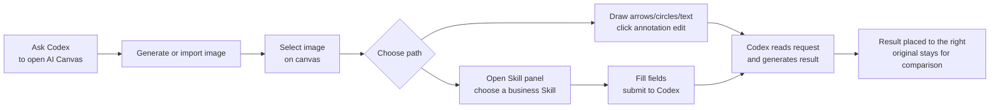

<div align="center">

  

# AI Canvas

### An AI infinite canvas for Codex: generate images, annotate edits, and run business design Skills.

[](./LICENSE)
[](#install)
[](./ai-canvas-codex-plugin/.mcp.json)
[](./ai-canvas-codex-plugin/package.json)
[](./ai-canvas-codex-plugin/package.json)
[](./README.md)
[](./README.en.md)

[中文](./README.md) · **English**

[Install](#install) · [Interface Preview](#interface-preview) · [Highlights](#highlights) · [Skill Workflows](#skill-workflows) · [Workflow](#workflow) · [Privacy](#privacy)

</div>

---

## What Is AI Canvas?

AI Canvas is a local AI canvas plugin for Codex. It combines prompt-to-image generation, visual annotation editing, one-click business Skills, and side-by-side version comparison in one workflow.

Think of it as:

```text
An AI drawing whiteboard plus a business image production desk inside Codex.
```

Users do not need to understand MCP tools, holder IDs, run metadata, or local file paths. Ask for an image, open the canvas, select an image, annotate or submit a Skill, and Codex places the result back on the canvas.

## Interface Preview

<div align="center">
  
</div>

## Highlights

| Capability | What It Does |
| --- | --- |
| Natural prompt to image | Ask Codex for an ad, cover, poster, product image, logo, or visual concept. |
| Local infinite canvas | Open a local tldraw-based canvas for ongoing annotation, asset layout, and version comparison. |
| Annotation-based editing | Arrows, text, circles, and rectangles become edit instructions after clicking `按标注修图`. |
| Skill panel | Built-in Social Media, E Commerce, Branding, Marketing, and Studio Skills. |
| Multi-image output | Product sets, brand systems, brochures, and platform adaptations can produce multiple images in sequence. |
| Local-first runtime | The canvas service runs on `127.0.0.1`; runtime data stays under the active workspace by default. |

## Install

### Recommended: Install Directly From GitHub

```bash
codex plugin marketplace add https://github.com/binghe1980/AI-Canvas --ref main
codex plugin add ai-canvas-codex-plugin@ai-canvas
```

Restart Codex or open a new chat, then try:

```text
@AI Canvas 打开 AI 画布，帮我做一张拉面广告。
```

### Local Development Install

```bash
git clone https://github.com/binghe1980/AI-Canvas.git
cd AI-Canvas/ai-canvas-codex-plugin
npm run setup
cd ..
codex plugin marketplace add .
codex plugin add ai-canvas-codex-plugin@ai-canvas
```

Full installation, update, and troubleshooting guide:

- [INSTALL.md](./ai-canvas-codex-plugin/INSTALL.md)
- [Chinese User Guide](./ai-canvas-codex-plugin/使用说明.md)

## Workflow



Daily use:

1. In Codex, say: `@AI Canvas 打开 AI 画布`.
2. Generate an image with Codex, or upload, drag, or paste an image into the canvas.
3. For local edits, draw arrows, circles, rectangles, and text near the image, then click `按标注修图`.
4. For business outputs, select an image, open the right-side `Skill 面板`, and choose a Skill.
5. Before processing Skills for the first time, say: `@AI Canvas 继续处理画布里的 Skill 请求`.
6. Fill the Skill fields and click `提交给 Codex 生成`; results are placed to the right of the source image.

## Skill Workflows

The current executable loop supports 6 built-in Skills. They are not static templates; each Skill turns the selected image, canvas state, form fields, and extra instructions into Codex generation jobs.

| Category | Skill | Best For | Output |
| --- | --- | --- | --- |
| Social Media | Xiaohongshu Cover | Note covers, product recommendation covers, personal-brand posts | Finished 3:4 cover |
| Social Media | YouTube Thumbnail | Knowledge channels, product videos, tutorials | 16:9 thumbnail |
| E Commerce | Product Marketing Set | Amazon, Shopify, Meta ads, general ecommerce visuals | Main image, selling-point image, scene image, detail image |
| Branding | Logo and Brand | New product, app, service, or brand identity exploration | Logo concepts, alternates, brand board |
| Marketing | Marketing Brochure | Trifold brochure, service brochure, campaign flyer, product brochure | Outer page, inner page, mockup, promo image |
| Studio | Cross-Platform Adaptation | Publish one visual across multiple social platforms | Xiaohongshu, Instagram, Story/Reels, WeChat, Twitter/X, LinkedIn ratios |

### Xiaohongshu Cover

Select an image, open `Social Media`, and choose `小红书封面`. Fill in content type, title, title style, title placement, and must-preserve elements. Codex outputs a finished 3:4 cover with typography, color, layout, and Chinese title baked into the image.

<div align="center">
  
</div>

### YouTube Thumbnail

Choose `YouTube 封面图` after selecting an image. Enter the video topic, main title, target audience, thumbnail style, title placement, and key elements to preserve. Codex generates a more recognizable 16:9 thumbnail.

<div align="center">
  
</div>

### Product Marketing Set

In `E Commerce`, choose `产品营销组图`. Generate product visuals for Amazon listing / A+, Shopify, Meta ads, Google display ads, or a general ecommerce set. It turns one product image into a fuller sales visual sequence.

<div align="center">
  
</div>

### Logo And Brand

In `Branding`, choose `Logo 与品牌`. Fill in brand name, industry, target audience, positioning, personality, logo style, and usage contexts. Codex generates logo concepts, alternates, and a brand visual board.

<div align="center">
  
</div>

### Marketing Brochure

In `Marketing`, choose `营销宣传册`. It supports trifold brochures, service brochures, campaign flyers, and product brochures, helping turn a campaign, course, service, or product message into multi-page marketing material.

<div align="center">
  
</div>

### Cross-Platform Adaptation

In `Studio`, choose `一键跨平台适配`. Pick target platforms, content type, text policy, must-preserve elements, and background strategy. Codex recomposes the image for platform ratios, safe areas, and usage contexts.

<div align="center">
  
</div>

## Example Prompts

```text
@AI Canvas 打开 AI 画布，帮我做一张小红书封面。

@AI Canvas 生成一张竖版拉面广告，品牌叫拉面一番，要高级食物摄影风格。

@AI Canvas 开启自动修图模式。

@AI Canvas 继续处理画布里的 Skill 请求。

@AI Canvas 按我画布上的标注修改。
```

## Use Cases

| User | How AI Canvas Helps |
| --- | --- |
| Social creators | Create Xiaohongshu covers, YouTube thumbnails, short-video covers, and cross-platform posts. |
| Ecommerce sellers | Expand one product image into main images, selling-point visuals, scene images, and ads. |
| Product and brand teams | Explore logo directions, brand boards, campaign assets, and product concepts. |
| Design collaboration | Use the canvas as a visual discussion workspace inside Codex. |
| Non-design users | Produce common business visuals through natural language and simple forms. |

## Docs

- [Plugin README](./ai-canvas-codex-plugin/README.md)
- [Installation Guide](./ai-canvas-codex-plugin/INSTALL.md)
- [Chinese User Guide](./ai-canvas-codex-plugin/使用说明.md)
- [Natural-Language Workflow](./ai-canvas-codex-plugin/自然语言工作流.md)
- [中文 README](./README.md)

## Repository Layout

```text
.agents/plugins/marketplace.json
ai-canvas-codex-plugin/
  .codex-plugin/plugin.json
  .mcp.json
  skills/
  packages/
    canvas-app/
    mcp-server/
    shared/
assets/
  ai-canvas-interface-preview.png
  skills/
```

Codex reads `.agents/plugins/marketplace.json` from this repository root. The marketplace points to `./ai-canvas-codex-plugin`.

## Privacy

- The canvas service runs locally on `127.0.0.1`, default port `43218`.
- Canvas state and generated assets are stored locally under `.ai-canvas/` in the active workspace unless `AI_CANVAS_HOME` is set.
- Local runtime data, test-generated images, temporary QA data, dependency folders, logs, and environment files are ignored by Git.
- The plugin does not include a hosted backend. It is a local Codex plugin workflow.

## Development

```bash
cd ai-canvas-codex-plugin
npm run setup
npm run typecheck
npm run test
npm run validate:plugin
```

Manual preview:

```bash
NODE_ENV=production node packages/canvas-app/dist/server/server.js \
  --port 43218 \
  --workspace-root "<your workspace>"
```

Open:

```text
http://127.0.0.1:43218/
```

## License

MIT. See [LICENSE](./LICENSE).
