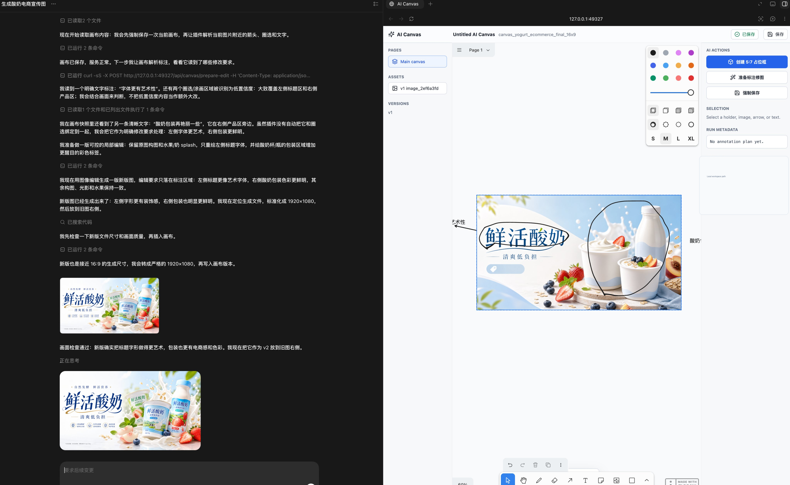
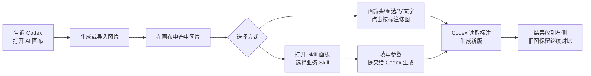
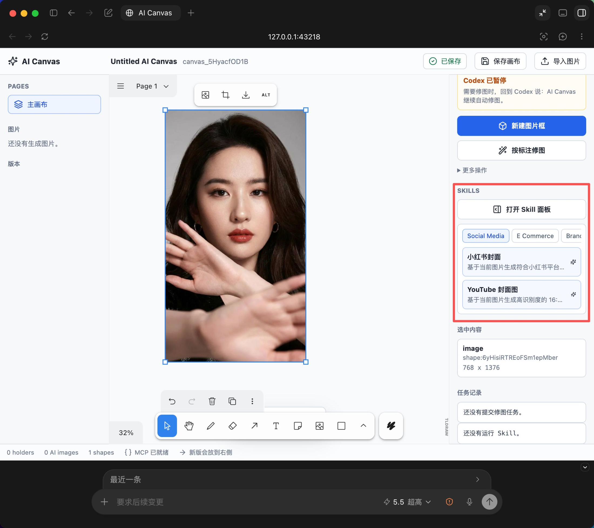
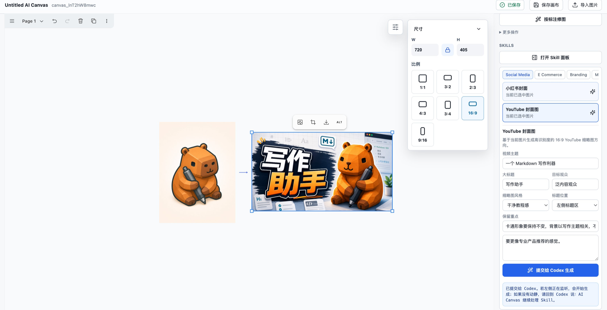
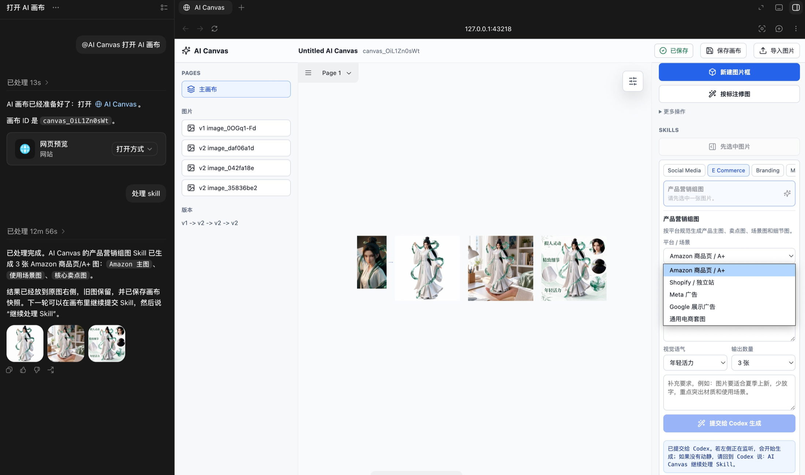
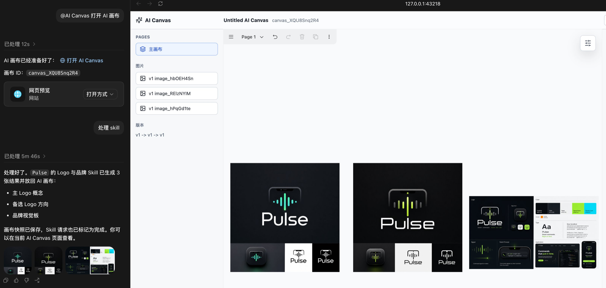
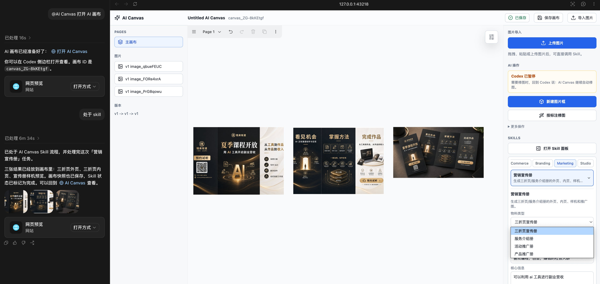
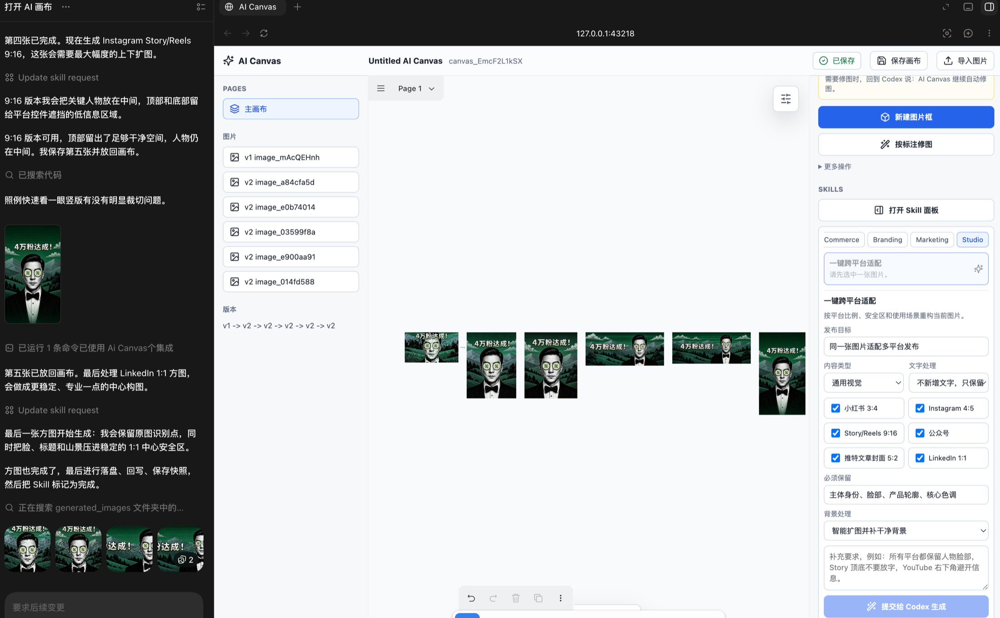

<div align="center">

# AI Canvas

### Codex 里的 AI 无限画布：生成图片、标注修图、Skill 工作流一次完成

[](./LICENSE)
[](#快速安装)
[](./ai-canvas-codex-plugin/.mcp.json)
[](./ai-canvas-codex-plugin/package.json)
[](./ai-canvas-codex-plugin/package.json)
[](./README.md)
[](./README.en.md)

**中文** · [English](./README.en.md)

[快速安装](#快速安装) · [界面展示](#界面展示) · [核心能力](#核心能力) · [Skill 工作流](#skill-工作流) · [使用流程](#使用流程) · [隐私说明](#隐私说明)

</div>

---

## 这是什么？

AI Canvas 是一个面向 Codex 的本地 AI 画布插件。它把「自然语言生成图片」「在画布上标注修改」「一键提交业务 Skill」「多版本对比」放到同一个工作流里。

你可以把它理解成：

```text
Codex 里的 AI 画图白板 + 业务制图工作台。
```

普通用户不需要理解 MCP、holder、run metadata 或本地文件路径。你只需要说需求、打开画布、选择图片、标注或提交 Skill，Codex 会把结果放回画布。

## 界面展示

<div align="center">
  
</div>

## 核心能力

| 能力 | 说明 |
| --- | --- |
| 自然语言生成图片 | 让 Codex 直接生成广告图、封面、海报、产品图、Logo 或视觉概念图。 |
| 本地无限画布 | 打开基于 tldraw 的本地画布，适合持续标注、摆放素材和横向对比版本。 |
| 按标注修图 | 箭头、文字、圆圈、矩形会被理解成修图意见，点击 `按标注修图` 即可提交给 Codex。 |
| Skill 面板 | 内置社媒、电商、品牌、营销、Studio 五类业务 Skill，可从右侧面板选择并填写参数。 |
| 多图批量产出 | 产品组图、品牌系统、宣传册、跨平台适配等 Skill 会按任务自动生成多张结果图。 |
| 本地优先 | 画布服务运行在 `127.0.0.1`，运行数据默认保存在当前工作区，不依赖托管后端。 |

## 快速安装

### 推荐方式：直接从 GitHub 安装

```bash
codex plugin marketplace add https://github.com/binghe1980/AI-Canvas --ref main
codex plugin add ai-canvas-codex-plugin@ai-canvas
```

安装后重启 Codex，或新开一个对话，然后输入：

```text
@AI Canvas 打开 AI 画布，帮我做一张拉面广告。
```

### 开发者本地安装

```bash
git clone https://github.com/binghe1980/AI-Canvas.git
cd AI-Canvas/ai-canvas-codex-plugin
npm run setup
cd ..
codex plugin marketplace add .
codex plugin add ai-canvas-codex-plugin@ai-canvas
```

完整安装、更新和排错说明：

- [安装指南 INSTALL.md](./ai-canvas-codex-plugin/INSTALL.md)
- [中文小白使用说明](./ai-canvas-codex-plugin/使用说明.md)

## 使用流程



日常使用：

1. 在 Codex 里说：`@AI Canvas 打开 AI 画布`。
2. 让 Codex 生成图片，或在画布里上传、拖拽、粘贴图片。
3. 需要局部修改时，在图片附近画箭头、圆圈、矩形并写文字，再点击 `按标注修图`。
4. 需要业务化产出时，选中图片，打开右侧 `Skill 面板`，选择对应 Skill。
5. 第一次处理 Skill 前，在 Codex 里说：`@AI Canvas 继续处理画布里的 Skill 请求`。
6. 在画布里填写参数并点击 `提交给 Codex 生成`，结果会自动放到原图右侧。

## Skill 工作流

当前真实生成闭环已经支持 6 个内置 Skill。它们不是简单模板，而是会把当前图片、画布选择、表单参数和补充要求整理成 Codex 可执行的生成任务。

| 分类 | Skill | 适合场景 | 输出 |
| --- | --- | --- | --- |
| Social Media | 小红书封面 | 笔记首图、种草封面、个人 IP 内容 | 3:4 成品封面图 |
| Social Media | YouTube 封面图 | 知识频道、产品视频、教程视频 | 16:9 缩略图 |
| E Commerce | 产品营销组图 | Amazon、Shopify、Meta 广告、通用电商图 | 主图、卖点图、场景图、细节图 |
| Branding | Logo 与品牌 | 新品牌命名、产品品牌、App 或服务品牌 | Logo 方向、备选方案、品牌视觉板 |
| Marketing | 营销宣传册 | 三折页、服务介绍册、活动推广册、产品推广册 | 外页、内页、样机、推广图 |
| Studio | 一键跨平台适配 | 同一张图快速适配多平台发布 | 小红书、Instagram、Story/Reels、公众号、推特、LinkedIn 等比例 |

### 小红书封面

选中一张图片，进入 `Social Media` 分类，选择 `小红书封面`。填写内容类型、主标题、标题风格、标题位置和必须保留的元素后提交。结果会直出包含字体、配色、版式和中文标题的完整 3:4 封面图。

<div align="center">
  
</div>

### YouTube 封面图

选中图片后选择 `YouTube 封面图`。输入视频主题、大标题、目标观众、缩略图风格、标题位置和保留重点，Codex 会生成更适合 16:9 展示的高识别度缩略图。

<div align="center">
  
</div>

### 产品营销组图

在 `E Commerce` 分类选择 `产品营销组图`。可按 Amazon 商品页 / A+、Shopify / 独立站、Meta 广告、Google 展示广告或通用电商套图生成多张物料，适合把一张产品图扩展成完整销售视觉。

<div align="center">
  
</div>

### Logo 与品牌

在 `Branding` 分类选择 `Logo 与品牌`。填写品牌名、行业、目标受众、定位差异点、品牌人格、Logo 风格和使用场景，Codex 会生成 Logo 概念、备选方向和品牌视觉板。

<div align="center">
  
</div>

### 营销宣传册

在 `Marketing` 分类选择 `营销宣传册`。支持三折页宣传册、服务介绍册、活动推广册、产品推广册，适合把活动、课程、服务或产品说明整理成可展示的多页营销物料。

<div align="center">
  
</div>

### 一键跨平台适配

在 `Studio` 分类选择 `一键跨平台适配`。选择发布平台、内容类型、文字处理、必须保留元素和背景策略后，Codex 会按平台比例、安全区和展示场景重构图片。

<div align="center">
  
</div>

## 常用提示词

```text
@AI Canvas 打开 AI 画布，帮我做一张小红书封面。

@AI Canvas 生成一张竖版拉面广告，品牌叫拉面一番，要高级食物摄影风格。

@AI Canvas 开启自动修图模式。

@AI Canvas 继续处理画布里的 Skill 请求。

@AI Canvas 按我画布上的标注修改。
```

## 适合谁用

| 用户 | 可以怎么用 |
| --- | --- |
| 自媒体创作者 | 做小红书封面、YouTube 缩略图、短视频封面、跨平台发布图。 |
| 电商卖家 | 把单张产品图扩展成主图、卖点图、场景图和广告图。 |
| 品牌/产品团队 | 快速探索 Logo 方向、品牌视觉板、活动物料和产品概念图。 |
| 设计协作场景 | 把画布当成 Codex 里的视觉讨论工作台，一边标注一边迭代。 |
| 非设计用户 | 不用学习专业设计软件，也能用自然语言和表单完成常见业务图。 |

## 项目文档

- [插件说明 README](./ai-canvas-codex-plugin/README.md)
- [安装指南 / Installation Guide](./ai-canvas-codex-plugin/INSTALL.md)
- [中文小白使用说明](./ai-canvas-codex-plugin/使用说明.md)
- [自然语言工作流](./ai-canvas-codex-plugin/自然语言工作流.md)
- [English README](./README.en.md)

## 仓库结构

```text
.agents/plugins/marketplace.json
ai-canvas-codex-plugin/
  .codex-plugin/plugin.json
  .mcp.json
  skills/
  packages/
    canvas-app/
    mcp-server/
    shared/
assets/
  ai-canvas-interface-preview.png
  skills/
```

Codex 会读取仓库根目录的 `.agents/plugins/marketplace.json`，这个 marketplace 指向 `./ai-canvas-codex-plugin`。

## 隐私说明

- 画布服务运行在本机 `127.0.0.1`，默认端口 `43218`。
- 画布状态和生成资源默认保存在当前工作区的 `.ai-canvas/`，除非设置了 `AI_CANVAS_HOME`。
- 本地运行数据、测试生成图片、临时 QA 数据、依赖目录、日志和环境变量文件都被 Git 忽略。
- 插件不包含托管后端，它是一个本地 Codex 插件工作流。

## 开发

```bash
cd ai-canvas-codex-plugin
npm run setup
npm run typecheck
npm run test
npm run validate:plugin
```

手动预览画布服务：

```bash
NODE_ENV=production node packages/canvas-app/dist/server/server.js \
  --port 43218 \
  --workspace-root "<your workspace>"
```

打开：

```text
http://127.0.0.1:43218/
```

## 许可证

MIT. See [LICENSE](./LICENSE).
