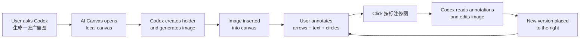

<div align="center">

# AI Canvas

### Codex 里的 AI 无限画布：自然语言生成图片，在画布上标注，再自动生成新版

[](./LICENSE)
[](#install)
[](./ai-canvas-codex-plugin/.mcp.json)
[](./ai-canvas-codex-plugin/package.json)
[](./ai-canvas-codex-plugin/package.json)
[](./ai-canvas-codex-plugin/使用说明.md)
[](./ai-canvas-codex-plugin/README.md)

[快速安装](#install) · [使用流程](#workflow) · [适合谁用](#use-cases) · [文档](#docs) · [隐私说明](#privacy)

</div>

---

## What Is AI Canvas?

AI Canvas is a Codex plugin marketplace that adds a local infinite canvas for image generation, visual annotation, and iterative image editing.

AI Canvas 是一个 Codex 插件 marketplace。它让 Codex 可以打开本地无限画布，生成图片，读取你在画布上的箭头、文字、圈选标注，并把修改后的新版本自动放到旧图右侧。

## Highlights

| Capability | English | 中文 |
| --- | --- | --- |
| Natural prompt to image | Ask Codex for an ad, cover, poster, product image, or visual concept. | 直接让 Codex 做广告图、封面、海报、产品图或视觉概念图。 |
| Local infinite canvas | Uses a local tldraw-based canvas opened from Codex. | 使用本地 tldraw 无限画布。 |
| Visual annotation editing | Arrows, text, circles, and rectangles become edit instructions. | 箭头、文字、圆圈、矩形会被理解成修图意见。 |
| Versioned iteration | New edited images are placed to the right; originals stay unchanged. | 新版放右侧，旧图保留，方便对比。 |
| Codex MCP tools | The plugin exposes MCP tools plus Codex skills for natural-language workflows. | 插件包含 MCP 工具和 Codex 技能，普通用户不用理解工具细节。 |

## Install

### Recommended: Install Directly From GitHub

```bash
codex plugin marketplace add https://github.com/binghe1980/AI-Canvas --ref main
codex plugin add ai-canvas-codex-plugin@ai-canvas
```

Then restart Codex or open a new chat, and try:

```text
@AI Canvas 打开 AI 画布，帮我做一张拉面广告。
```

### Local Development Install

```bash
git clone https://github.com/binghe1980/AI-Canvas.git
cd AI-Canvas/ai-canvas-codex-plugin
npm run setup
cd ..
codex plugin marketplace add .
codex plugin add ai-canvas-codex-plugin@ai-canvas
```

Full installation guide:

- [INSTALL.md](./ai-canvas-codex-plugin/INSTALL.md)

## Workflow



Daily use in one minute:

1. Tell Codex what image you want.
2. Open the returned local canvas link.
3. Mark changes on the image with arrows, text, circles, or rectangles.
4. Say `@AI Canvas 开启自动修图模式`.
5. Click `按标注修图` on the canvas after each batch of annotations.
6. Compare the original and new version side by side.

## Example Prompts

```text
@AI Canvas 打开 AI 画布，帮我做一张小红书封面。

@AI Canvas 生成一张竖版拉面广告，品牌叫拉面一番，要高级食物摄影风格。

@AI Canvas 开启自动修图模式。

@AI Canvas 按我画布上的标注修改。
```

## Use Cases

| Scenario | What AI Canvas Helps With |
| --- | --- |
| Social covers | 小红书封面、短视频封面、活动海报 |
| Ads and banners | Product ads, food ads, campaign visuals |
| Product concepts | Visual moodboards, packaging directions, hero images |
| Iterative editing | Mark a region, ask for changes, keep every version |
| Design review | Use the canvas as a shared visual thinking surface inside Codex |

## Docs

- [Plugin README](./ai-canvas-codex-plugin/README.md)
- [Installation Guide / 安装指南](./ai-canvas-codex-plugin/INSTALL.md)
- [中文小白使用说明](./ai-canvas-codex-plugin/使用说明.md)
- [自然语言工作流](./ai-canvas-codex-plugin/自然语言工作流.md)

## Repository Layout

```text
.agents/plugins/marketplace.json
ai-canvas-codex-plugin/
  .codex-plugin/plugin.json
  .mcp.json
  skills/
  packages/
    canvas-app/
    mcp-server/
    shared/
```

Codex reads `.agents/plugins/marketplace.json` from this repository root. The marketplace points to `./ai-canvas-codex-plugin`.

## Privacy

- The canvas service runs locally on `127.0.0.1`, default port `43218`.
- Canvas state and generated assets are stored locally under `.ai-canvas/` in the active workspace unless `AI_CANVAS_HOME` is set.
- Local runtime data, temporary QA data, dependency folders, logs, and environment files are ignored by Git.
- The plugin does not include a hosted backend. It is a local Codex plugin workflow.

## Development

```bash
cd ai-canvas-codex-plugin
npm run setup
npm run typecheck
npm run test
npm run validate:plugin
```

Manual preview:

```bash
NODE_ENV=production node packages/canvas-app/dist/server/server.js \
  --port 43218 \
  --workspace-root "<your workspace>"
```

Open:

```text
http://127.0.0.1:43218/
```

## License

MIT. See [LICENSE](./LICENSE).
