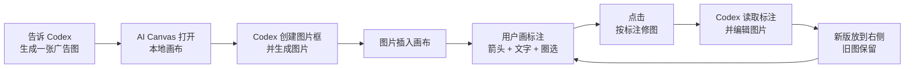

<div align="center">

# AI Canvas

### Codex 里的 AI 无限画布：自然语言生成图片，在画布上标注，再自动生成新版

[](./LICENSE)
[](#快速安装)
[](./ai-canvas-codex-plugin/.mcp.json)
[](./ai-canvas-codex-plugin/package.json)
[](./ai-canvas-codex-plugin/package.json)
[](./README.md)
[](./README.en.md)

**中文** · [English](./README.en.md)

[快速安装](#快速安装) · [使用流程](#使用流程) · [适合谁用](#适合谁用) · [项目文档](#项目文档) · [隐私说明](#隐私说明)

</div>

---

## 这是什么？

AI Canvas 是一个 Codex 插件 marketplace。它让 Codex 可以打开本地无限画布，生成图片，读取你在画布上的箭头、文字、圈选标注，并把修改后的新版本自动放到旧图右侧。

你可以把它理解成：

```text
Codex 里的 AI 画图白板。
```

普通用户不需要理解 MCP、holder、run metadata 或本地文件路径。你只需要说需求、打开画布、标注修改意见、点击按钮。

## 核心能力

| 能力 | 说明 |
| --- | --- |
| 自然语言生成图片 | 让 Codex 直接生成广告图、封面、海报、产品图或视觉概念图。 |
| 本地无限画布 | 打开基于 tldraw 的本地画布，适合持续标注和对比版本。 |
| 标注驱动修图 | 箭头、文字、圆圈、矩形会被理解成修图意见。 |
| 保留历史版本 | 新版图片放在右侧，旧图保留，方便对比。 |
| Codex 插件工作流 | 内置 MCP 工具和 Codex skills，用户用自然语言即可操作。 |

## 快速安装

### 推荐方式：直接从 GitHub 安装

```bash
codex plugin marketplace add https://github.com/binghe1980/AI-Canvas --ref main
codex plugin add ai-canvas-codex-plugin@ai-canvas
```

安装后重启 Codex，或新开一个对话，然后输入：

```text
@AI Canvas 打开 AI 画布，帮我做一张拉面广告。
```

### 开发者本地安装

```bash
git clone https://github.com/binghe1980/AI-Canvas.git
cd AI-Canvas/ai-canvas-codex-plugin
npm run setup
cd ..
codex plugin marketplace add .
codex plugin add ai-canvas-codex-plugin@ai-canvas
```

完整安装、更新和排错说明：

- [安装指南 INSTALL.md](./ai-canvas-codex-plugin/INSTALL.md)

## 使用流程



一分钟日常使用：

1. 在 Codex 里说你想要什么图。
2. 打开 Codex 返回的本地画布链接。
3. 在图片上画箭头、写文字、圈出区域。
4. 第一次改图前说：`@AI Canvas 开启自动修图模式`。
5. 每批标注完成后，在画布上点 `按标注修图`。
6. 在画布上对比旧版和新版，继续迭代。

## 常用提示词

```text
@AI Canvas 打开 AI 画布，帮我做一张小红书封面。

@AI Canvas 生成一张竖版拉面广告，品牌叫拉面一番，要高级食物摄影风格。

@AI Canvas 开启自动修图模式。

@AI Canvas 按我画布上的标注修改。
```

## 适合谁用

| 场景 | AI Canvas 能帮你做什么 |
| --- | --- |
| 社媒封面 | 小红书封面、短视频封面、活动海报 |
| 广告物料 | 食物广告、产品广告、活动 banner、主视觉 |
| 产品概念 | 情绪板、包装方向、视觉草案、hero 图 |
| 反复修图 | 标一个区域，生成一版，保留旧图继续对比 |
| 视觉评审 | 把画布当成 Codex 里的视觉讨论工作台 |

## 项目文档

- [插件说明 README](./ai-canvas-codex-plugin/README.md)
- [安装指南 / Installation Guide](./ai-canvas-codex-plugin/INSTALL.md)
- [中文小白使用说明](./ai-canvas-codex-plugin/使用说明.md)
- [自然语言工作流](./ai-canvas-codex-plugin/自然语言工作流.md)
- [English README](./README.en.md)

## 仓库结构

```text
.agents/plugins/marketplace.json
ai-canvas-codex-plugin/
  .codex-plugin/plugin.json
  .mcp.json
  skills/
  packages/
    canvas-app/
    mcp-server/
    shared/
```

Codex 会读取仓库根目录的 `.agents/plugins/marketplace.json`，这个 marketplace 指向 `./ai-canvas-codex-plugin`。

## 隐私说明

- 画布服务运行在本机 `127.0.0.1`，默认端口 `43218`。
- 画布状态和生成资源默认保存在当前工作区的 `.ai-canvas/`，除非设置了 `AI_CANVAS_HOME`。
- 本地运行数据、临时 QA 数据、依赖目录、日志和环境变量文件都被 Git 忽略。
- 插件不包含托管后端，它是一个本地 Codex 插件工作流。

## 开发

```bash
cd ai-canvas-codex-plugin
npm run setup
npm run typecheck
npm run test
npm run validate:plugin
```

手动预览画布服务：

```bash
NODE_ENV=production node packages/canvas-app/dist/server/server.js \
  --port 43218 \
  --workspace-root "<your workspace>"
```

打开：

```text
http://127.0.0.1:43218/
```

## 许可证

MIT. See [LICENSE](./LICENSE).
